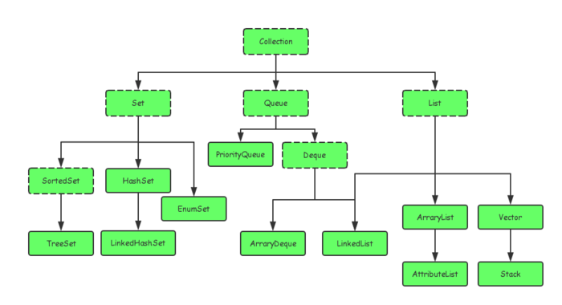
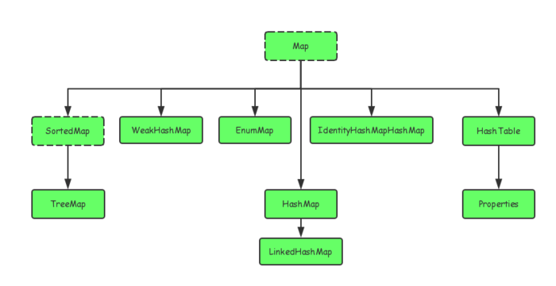
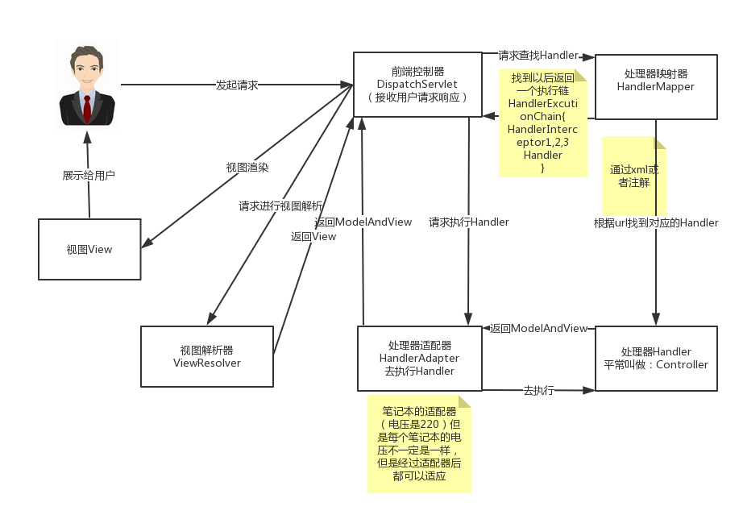

#### Java基础

1. Object类都有哪些方法，简单描述一下

   1. 构造函数public Object()

   2. private static native void registerNatives()

      其主要作用是将C/C++中的方法映射到Java中的native方法，实现方法命名的解耦

   3. protected native Object clone() throws CloneNotSupportedException

      clone函数返回的是一个引用，指向的是新的clone出来的对象，此对象与原对象分别占用不同的堆空间

   4. public final native Class<?> getClass()

      也是一个native方法，返回的是此Object对象的类对象/运行时类对象Class<?>。效果与Object.class相同

   5. public boolean equals(Object obj)

      判断两个对象是否相等，Object类中的equals()方法等同于==

   6. public native int hashCode()

      返回对象的Hash值，在Java应用程序的同一次执行期间，对于同一对象多次调用hashCode()方法时，其返回的哈希码是相同的

   7. public String toString()

      ```java
      public String toString() {
          return getClass().getName() + "@" + Integer.toHexString(hashCode());
      }
      ```

      toString()是由对象的类型和其哈希码唯一确定，同一类型但不相等的两个对象分别调用toString()方法返回的结果可能相同

   8. wait()/wait(long timeout)/wait(long timeout, int nanos)

      调用此方法所在的当前线程等待（释放其所持有的同步代码块中的锁），直到在其他线程上调用此方法的主调（某一对象）的notify()/notifyAll()方法（可以指定Timeout时间）

   9. notify()/notifyAll()

      唤醒在此对象监视器上等待的单个线程/所有线程，调用后，其所在线程不会立即释放所持有的锁，直到其所在同步代码块中的代码执行完毕，此时释放锁，因此，如果其同步代码块后还有代码，其执行则依赖于JVM的线程调度

   10. protected void finalize()

       Object类中finalize方法被定义成一个空方法，仅仅表明Java中每一个对象都将具有finalize这种行为，在JVM准备对此对象所占用的内存空间进行垃圾回收前，finalize()方法将被调用

2. equals()方法跟hashcode()方法之间的关系

   - 若两个对象相等（等价于equals()方法为真），则这两个对象调用hashCode()返回的哈希码也必须相等
   - 但是两个对象调用hasCode()返回的哈希码相等时，这两个对象不一定相等
   - 两个对象相等 <==\> equals()为真 ==>  hashCode()相等
   - hashCode()相等 =\=\> equals()为真  <==> 两个对象相等

3. Java基本类型占用字节数

   - 1字节： byte , boolean
   - 2字节： short , char
   - 4字节： int , float
   - 8字节： long , double

4. char和double的字节，以及在内存的分布是怎样

5. 抽象方法与抽象类

   - 抽象方法
     - 没有方法体的方法，必须使用关键字abstract修饰
     - 必须为public或者protected（因为如果为private，则不能被子类继承，子类便无法实现该方法），缺省情况下默认为public
   - 抽象类
     - 拥有抽象方法的类就是抽象类，必须使用关键字abstract修饰
     - 不能直接实例化，需要依靠子类采用向上转型的方式处理
     - 必须有子类
     - 若子类不是抽象类，则必须覆写抽象类中所有的抽象方法，否则子类仍然需要定义为一个抽象类
     - 抽象类中一定存在构造方法，其存在目的是为了属性的初始化。 并且子类对象实例化的时候，依然满足先执行父类构造，再执行子类构造的顺序
     - 抽象类不能用final修饰，因为final修饰类表明该类不能有子类，与抽象类相矛盾
     - 抽象类可以没有抽象方法，目的是不希望这个类被实例化。这种形式在Spring源码中实现单例模式就用到了

6. static关键字与抽象

   - 抽象方法不能用static修饰
     - 抽象方法就是为了重写，而静态方法不可以被重写
   - 抽象类某些情况下可以用static修饰
     - 外部抽象类不允许使用static声明
     - 内部的抽象类允许使用static声明，使用static声明的内部抽象类相当于一个外部抽象类，继承的时候使用“外部类.内部类”的形式表示类名称

7. 接口及其与抽象类的区别

   - 接口：行为的抽象
   - 与抽象类的区别
     1. 接口中的成员变量必须为public static final类型，而抽象类中的成员变量可以是各种类型的
     2. 接口中的方法必须为public abstract类型
     3. 接口中不能含有静态代码块以及静态方法，而抽象类可以有静态代码块和静态方法
     4. 接口中的所有方法必须都是抽象方法
     5. 一个类只能继承一个抽象类，而一个类却可以实现多个接口
     6. 从抽象层面上来看，抽象类是对一系列类的抽象，包括属性、行为，但是接口仅仅是对一系列行为的抽象
     7. 从设计层面上来看，抽象类对应模版设计模式。接口定义的是行为规范，其对应辐射式设计模式

8. 单继承

   - 定义：一个子类只能有一个直接父类
   - 原因：若支持多继承，当多个父类中含有相同成员变量/方法时，会产生调用的不确定性
   - 接口支持多继承，这是因为接口中仅定义了行为，而没有具体的实现

9. 重写和重载区别

   - 重载（Over loading）
     - 在类中可以创建多个同名方法，具有不同的参数和不同的定义，调用时，通过参数个数与参数类型决定具体执行的方法
     - 无法以返回型别作为重载函数的区分标准
     - 同一个类中的多态性
   - 重写（Over riding）
     - 若子类中某个函数，其参数、返回类型与父类中同名方法相同，则子类中的该方法将覆盖父类的方法
     - 可使用super关键字引用被重写的父类的方法
     - 子类方法的访问修饰权限不能少于父类被重写的方法
     - 父类的异常宽泛性必须比子类的广
     - 提现了父类与子类之间的多态性

10. 多态

11. 成员变量与局部变量的区别

    - 成员变量：类范围内定义的变量

      - 类变量（有static修饰），也称为静态变量

        在类加载时期分配内存空间，并指定默认初始值

      - 实例变量（不用static修饰）

        在创建实例时分配内存空间，并指定初始值

    - 局部变量：方法内定义的变量，除了形参外，都必须显示初始化，保存在其所在的方法的栈内存中

      - 形参

        整个方法内有效

      - 方法局部变量

        从定义这个变量开始到方法结束这一段时间内有效

      - 代码块局部变量

        从定义这个变量开始到代码块结束这一段时间内有效

12. static关键字与final关键字

    - static：方便在没有创建对象的情况下来进行调用（方法/变量）

      1. 修饰类的成员变量，此时该变量称为静态变量（类变量）
         - 静态变量的初始化发生在类加载时期（存放于方法区）
         - 被该类所有对象共享，在内存中只有一个副本
      2. 修饰类的成员方法，此时该方法称为静态方法（类方法）
         - 不依赖于任何具体的对象，只要类加载完成，其对应的静态方法就可以被访问
         - 静态方法不能被重写，只能被隐藏。子类只能继承父类的静态方法，不能重写父类静态方法，子类隐藏了父类的静态方法。
      3. 修饰代码块，称为静态代码块
         - 只会在类加载的时候执行一次
         - 很多时候会将一些只需要进行一次的初始化操作都放在static代码块中进行
      4. 修饰内部类，此时该内部类称为静态内部类（嵌套内部类）
         - 创建静态类内部对象时，不需要其外部类的对象
         - 不用，不加载。个人理解，此静态内部类，会存在一个虚表中，并和外部类关联，当外部类使用此内部类时，才完成加载

    - final

      1. 修饰变量，只能被赋值一次并无法改变，表明这是一个常数

         - 成员变量

           必须在变量声明时，或者构造方法中对其赋值

         - 局部变量

           final标记的局部变量可以只声明不赋值，然后再进行一次性的赋值，在该变量的生存周期内不能被改变

      2. 修饰方法，表示该方法在子类中不能被重写

      3. 修饰类，表示该类不能被继承

13. 类访问权限

    |           | 同一个类 | 同一个包 | 不同包的子类 | 不同包的非子类 |
    | :-------: | :------: | :------: | :----------: | :------------: |
    |  private  |   true   |          |              |                |
    |  default  |   true   |   true   |              |                |
    | protected |   true   |   true   |     true     |                |
    |  public   |   true   |   true   |     true     |      true      |

14. 反射用到了哪些接口，哪些类? 

15. 反射机制中可以获取private成员的值吗 

    可以，但要执行setAccessible()方法

    例如：

    ```java
    
    ```

    

#### Java集合框架

1. 集合的体系

   Java集合类主要由Collection与Map两个接口派生而出，下图中虚线表现接口，实线表现具体实现类

   - Collection接口

     

   - Map接口

     

2. List集合，区别，联系，源码

   List代表一个元素有序、可重复的集合，集合中每个元素都有其对应的顺序索引，Collection接口的基础上增加了一些根据索引进行访问的方法

   - ArrayList
     - 基于数组实现，内部封装了一个动态的、允许再分配的数组
     - 非线程安全（线程安全就是加锁，不会出现多线程同时访问）
     - 通过索引随机访问性能最好，使用迭代器访问性能较低
   - Vector
     - 基于数组实现，内部封装了一个动态的、允许再分配的数组
     - 线程安全版本的ArrayList，但性能较ArrayList差
   - Stack
     - 基于Vector实现
     - 线程安全
     - 性能较差，且过于老旧，不推荐使用，需要实现数据结构“栈”时，推荐使用LinkedList（addFirst()和removeFirst()方法）
   - LinkedList
     - 同时实现了List接口与Deque接口，即可以作为普通List使用（索引随机访问），也可以作为双端队列使用（栈/队列）
     - 内部以链表的形式保存元素，随机访问性能较低，在插入、删除元素时性能较好
     - 非线程安全

3. Map集合，内部实现原理、源码、适用场景

   存放键值对的集合，键不予许重复

   - HashMap
     - 基于散列表实现，解决冲突方法是拉链法
     - 非线程安全
     - 适用于快速查询
   - Hashtable
     - HashMap的线程安全版本，性能较差
     - 源码中containsKey、get、remove、put等方法都用synchronized修饰了
   - weakHashMap
     - 通过弱引用来管理其内部元素，这些元素可能在GC期间被自动回收（仅有弱引用关联），即使没有显式调用remove()或clear()方法
     - 适用于需要缓存的场景。在缓存场景下，由于内存是有限的，不能缓存所有对象；对象缓存命中可以提高系统效率，但缓存MISS也不会造成错误，因为可以通过计算重新得到
   - LinkedHashMap
     - HashMap的子类，使用双向链表来维护key-value对的次序
     - 适合迭代访问Map中的键值对元素，按照添加key-value对的顺序输出
     - 非线程安全
     - 维护双向链表，性能较HashMap差
     - 适用于对插入顺序有需求的场合
   - TreeMap
     - SortedMap接口的实现类，有序的键值对集合
     - 底层基于红黑树实现，每个键值对为红黑树的一个节点，元素类型必须实现Comparable接口
     - 非线程安全
     - 由于要维护红黑树，性能最差
     - 适用于希望Map中元素有序的场合

4. Set集合，基于什么实现，内部数据结构，适用场景，源码

   Set类基本都是基于其对应的Map类来实现的，其内部会维护一个对应的Map，Set本质上等价于该Map的Key Set

   - HashSet
     - 基于HashMap实现（散列表），无序
     - 非线程安全
     - 性能好，适合添加、查询需求频繁的场景
   - LinkedHashSet
     - HashSet的子类，基于LinkedHashSet实现
     - 使用链表维护元素的次序，使得元素是以插入的顺序来保存的
     - 非线程安全
     - 性能较HashSet差，但更适合插入、删除与遍历操作
   - TreeSet
     - SortedSet接口的实现类，基于TreeMap实现
     - 能够保证Set内的元素是有序的，前提是元素类型必须实现Comparable接口，并依此作为排序依据
     - 红黑树
     - 由于需要维护红黑树，因此性能最低，适用于希望得到一个有序Set的场景
     - 非线程安全

5. Queue集合，基于什么实现，内部数据结构，适用场景，源码

   - PriorityQueue
     - 优先级队列，队列元素的顺序不是按加入队列的顺序，而是按队列元素的大小进行重新排序，默认最小的在队列头
     - 非线程安全
     - 对线程安全有需求，则建议使用PriorityBlockingQueue
   - ArrayDeque
     - 双端队列，使用数组实现
     - 非线程安全
     - 作为栈使用时，性能比Stack好；当作为队列使用时，性能比LinkedList好。

6. HashMap底层

   - 底层用散列表实现，遇到数据冲突时，使用的是冲突链表法（拉链法）

     - 散列表采用的四种冲突解决方法：

       1. 开放地址法（再散列法）

          1. 线性探测再散列（探测步长线性增长）
          2. 平方探测再散列（探测步长二次幂增长）
          3. 伪随机探测再散列

       2. 冲突链表法（拉链法）

          将hash表本身看作是一个单链表的数组，数组中每个元素都是对应单链表的头指针，将相同hash值的元素均放入同一个单链表中

       3. 再哈希法

          定义多个hash函数，在第一个hash函数得到相同值后，使用第二个hash函数再进行hash，以此类推，直到冲突不再发生，优点是不容易产生聚集，缺点是hash计算比较耗时

       4. 公共溢出区法

          将哈希表分为基本表和溢出表两部分，凡是和基本表发生冲突的元素，一律填入溢出表

   - 有两个参数可以影响HashMap的性能：初始容量（inital capacity）和负载系数（load factor）

     - 初始容量（inital capacity）

       指定map的初始容量，默认为16，每次扩容会乘以二，因此实际容量必然是2的整数次幂（加快hash速度）

     - 负载系数（load factor）

       用于指定自动扩容的临界值（threshold），当map内部存储的元素（entry）数量的比例超过负载系数时，map会进行自动扩容，并进行重新哈希

       负载系数越大，空间利用率越高，对应的冲突几率也越大，反之能减少冲突几率，但是空间利用率也随之降低

   - 具体方法实现

     - put()
       1. 根据key值计算其对应的hash值（若key为null，则hash值直接为0）
       2. 将hash值与数组的长度取余，得到在数组中的索引，表明该键值对要放入的bucket
       3. 使用头插法将新的键值对插入对应bucket的元素链表中去（若key已经存在，则替换value）
     - get()
       1. 根据key值计算其对应的hash值（若key为null，则hash值直接为0）
       2. 将hash值与数组的长度取余，得到在数组中的索引，表明要查找的元素存放的bucket位置
       3. 在对应元素链表中迭代，查找符合条件的entry（依据key的equals()方法），找到则返回该entry，否则返回null
     - remove()
       1. 根据key值计算其对应的hash值（若key为null，则hash值直接为0）
       2. 将hash值与数组的长度取余，得到在数组中的索引，表明要删除的元素存放的bucket位置
       3. 在对应的元素链表中查找该key对应的entry，并移除

7. TreeMap底层，红黑树原理

   - 底层使用红黑树实现，每个键值对对应树的一个节点


   - 红黑树基本性质
     1. 树的节点只有红与黑两种颜色
     2. 根节点为黑色的
     3. 叶子节点（这里的叶节点为NULL节点）为黑色的
     4. 红色节点的子节点必定是黑色的
     5. 从任意一节点出发，到其后继的叶子节点的路径中，黑色节点的数目相同
   - TreeMap的增删改查的效率都是O(Log(n))

8. HashMap与Hashtable区别

   1. HashMap非线程安全，Hashtable是线程安全的

      公开的方法比如get都使用了synchronized描述符。而遍历视图比如keySet都使用了Collections.synchronizedXXX进行了同步包装

   2. HashMap支持键为null（null的hashCode指定为0），Hashtable不支持

   3. Hashtable不推荐使用，如果需要线程安全，那么使用ConcurrentHashMap

9. ConcurrentHashMap，原理、源码，ConcurrentHashMap锁加在了哪些地方

   - Hashtable使用synchronized关键字来同步，一张哈希表对应一个锁，在多线程环境下，锁的竞争非常激烈，导致效率低下

   - 分段锁

     ConcurrentHashMap将数据分成一段一段的存储，每一段称为一个Segment，每个Segment相当于一个子Hash表，然后给每一段数据配一把锁，当一个线程占用锁访问其中一个段数据的时候，其他段的数据也能被其他线程访问。有些方法需要跨段，比如size()和containsValue()，它们可能需要锁定整个表而而不仅仅是某个段，这需要按顺序锁定所有段，操作完毕后，又按顺序释放所有段的锁

   - final与volatile的使用

     在ConcurrentHashMap内部，段数组是final的，并且其成员变量实际上也是final的

   - 具体方法实现：

     1. put()

        需要先持有段锁，再使用段的put()方法实现

     2. get()

        get操作不需要锁，因为将要使用的共享变量都定义成了volatile

     3. remove()

        先定位到段，然后委托给段的remove操作。当多个删除操作并发进行时，只要它们所在的段不相同，它们就可以同时进行

10. CopyOnWriteArrayList (set)，什么情况加锁、什么情况不加锁、适用场景

11. ArrayblockingQueue (Linked)，两者区别，take、put、offer、poll方法原理、源码

#### JVM

1. java内存模型

2. JVM相关，JVM

3. JVM五大区

   - 堆（Heap）

   - 方法区

     是JVM在装载类文件时，用于存储类型信息的(类的描述信息)

   - 虚拟机栈

   - 本地方法栈

   - 程序计数器

4. 堆和栈的区别

5. 对象内存布局
   - 对象头（Header）
     - 对象自身运行时数据，包括HashCode、GC分代年龄、锁状态标志、线程持有的锁、偏向线程ID、偏向时间戳，这部分长度为32bit或者64bit（分别对应32位与64位虚拟机）
     - 类型指针，即对象指向它的类元数据的指针，虚拟机通过这个指针来确定这个对象是哪个类的实例
     - 如果该对象是Java数组，则还需要存储该数组的长度
   - 实例数据（Instance）
     - 对象真正存储的有效信息，即程序代码中定义的各种类型的字段内容，包括从父类继承的，和子类中定义的
     - 存储顺序收到JVM存储策略的影响，相同宽度的总被分配到一起，满足此前提时，父类中定义的变量总是出现在子类之前
   - 对齐填充（Padding）
     - 没有实际含义
     - HotSpot VM要求所有对象大小均为8字节的整数倍，用于对象头正好是8字节的整数倍，当实例数据部分不满足此约束时，就需要进行对齐填充

6. 如何判断对象是否需要回收

   - 引用计数法

     - 简介：给对象添加一个引用计数器，每当该对象被引用一次，该计数器就+1，引用失效，则-1。任何时刻，计数器值为0的对象就是不可能再被使用的（已死）
     - 缺点：无法解决对象之间相互循环引用的问题

   - 可达性分析算法

     - 简介：以一个称为GC root的对象作为起始点，向下搜索，搜索走过的路径称为引用链，当一个对象与GC root之间没有任何的引用链存在时，证明该对象是不可达的，即被判断为可回收的对象

   - 引用类型

     1. 强引用（Strong Reference）

        最常见的引用（例：Object obj = new Object()），被强引用的对象永远不会被垃圾收集器回收

     2. 软引用（Soft Reference）

        用于描述一些还有用，但是并非必需的对象，当将要发生内存溢出异常时，会将软引用的对象列入回收范围

     3. 弱引用（Weak Reference）

        描述非必需对象，强度比软引用更低，弱引用关联的对象只能存活到下一次垃圾回收操作之前，一旦垃圾收集器开始工作，不论当前内存是否足够，均会将弱引用的对象列入回收范围

     4. 虚引用（Phantom Reference）

        最弱的引用关系，虚引用的存在不会对该对象的生存时间造成影响，也无法通过虚引用来获得对象实例，为一个对象设置虚引用的唯一目的就是在该对象被垃圾回收器回收时，收到一个系统通知

7. 对象的死亡过程

   即使一个对象被可达性算法所标记为不可达，其死亡也不是立刻执行的，要真正宣告对象死亡，至少需要经过两次标记过程

   1. 当一个对象被标记后，判断该对象是否有必要执行其finalize()方法，若该对象未覆盖finalize()方法或者finalize()方法已经被虚拟机调用过，则不需要执行
   2. 若需要执行，则由虚拟机通过一个更低优先级的Finalizer线程去执行其finalize()方法，若在该方法中，对象与引用链上任意一个对象建立了关联，则该对象在第二次被标记时，会被移出“即将回收”集合，否则才被真正回收
   3. 任何一个对象的finalize()方法只会被系统自动调用一次
   4. 不建议在程序中使用finalize()方法

8. 垃圾回收算法

   - 标记-清除（Mark-Sweep）算法
     - 简介：先标记出所有需要回收的对象，在标记完成后，进行统一回收
     - 缺点：
       1. 标记和清除两个过程的效率都比较低
       2. 清除之后会产生大量的内存碎片
   - 复制（Copying）算法
     - 简介：将内存分为大小相等的两块，每次只使用其中一块。当一块内存用完之后，就将其中还存活的对象复制到另外一块内存中去，然后将原使用过的那一半内存区域整个清空
     - 缺点：将可用内存缩小至原来的一半
   - 改进的复制（Copying）算法
     - 简介：现在的商业虚拟机均使用复制算法来进行新生代的回收，由于新生代的对象绝大部分是“朝生夕死”（在创建出来后很快就失活）的，因此并不需要1：1的比例来划分内存空间。实际上是将内存分为一块较大的Eden空间与两块较小的Survivor空间，每次只使用Eden与一块Survivor，当需要进行垃圾回收时，将Eden与被使用的Survivor空间中存活的对象一次性复制到另一块Survivor空间中去，再去清理Eden与之前所使用的那块Survivor
     - 触发回收时，当Eden与当前Survivor空间中存活的对象太多，剩下那块Survivor空间存放不下时，就需要通过分配担保机制，讲这些对象直接放进老年代内存空间
     - 使用场景：新生代内存回收
     - 缺点：当对象存活率较高时，大量的复制操作使得效率低下，且频繁需要进行内存分配担保，不适合老年代的回收
   - 标记-整理（Mark-Compact）算法
     - 简介：对内存空间中所有对象进行标记后，让其中存活的对象向一端移动，然后直接清理掉边界以外的内存
     - 使用场景：老年代内存回收

9. 垃圾回收的分代回收

   将Java堆分为新生代与老年代：

   - 新生代

     - 特点：每次回收时只有少量对象存活

     - 复制算法

   - 老年代

     - 特点：存活率高，且没有额外空间进行内存分配担保
     - 标记-清理算法，或者标记-整理算法

10. 垃圾回收器

   - Serial收集器

     - 简介：新生代收集器，单线程，采用复制算法，Client模式下的默认新生代收集器
     - 特点：简单高效， 执行回收时需要“Stop The World”

   - ParNew收集器

     - 简介：Serial收集器的多线程版本，新生代， 复制算法，许多虚拟机在Server模式下的默认新生代收集器
     - 特点：可以与CMS收集器搭配

   - Parallel Scavenge收集器

     - 简介：新生代， 复制算法，多线程
     - 特点：关注吞吐量，因此也被称为“吞吐量优先收集器”

   - Serial Old收集器

     - 简介：Serial收集器的老年代版本，单线程，标记-整理，多用于Client模式

   - Parallel Old收集器

     - 简介：Parallel Scavenge收集器的老年代版本，多线程，标记-整理算法
     - 特点：在注重吞吐量及CPU资源敏感的场合，配合Parallel Scavenge收集器可以实现完整的“吞吐量优先”收集器组合

   - CMS（Concurrent Mark Sweep）收集器

     - 简介：老年代，多线程，基于标记-清除算法，目的是为了获得最短的回收停顿时间

     - 过程：

       1. 初始标记

          单线程，“Stop The World”，标记GC Roots能直接关联到的对象，速度很快

       2. 并发标记

          多线程，进行GC Roots Tracing，占用时间最久，但是可以与用户线程一起进行

       3. 重新标记

          多线程，“Stop The World”，对那些在并发标记阶段，由于用户线程的继续运行而产生变化的对象进行标记更新，时间比初始标记阶段稍长，但是远小于并发标记

       4. 并发清除

          多线程，可以与用户线程一起运行

     - 优点：耗时最长的并发标记与并发清除过程均能与用户线程一起运行，而不会造成“Stop The World”，这能大幅缩短回收停顿时间

     - 缺点：

       1. 对CPU资源比较敏感（因为并发时和用户线程一起占用CPU资源）

       2. 无法处理浮动垃圾

          这里的浮动垃圾指的是在并发清理阶段由用户线程所产生的垃圾，该次垃圾回收无法处理这些垃圾，只能交由下次回收。同时，用于垃圾回收期间用户线程还需要正常运行，因此需要预留部分内存空间以供使用，实际情况中，老年代空间使用率高于某一值（JDK1.6中为92%）时，就会触发一次垃圾回收，若虚拟机预留的内存空间不够用，则启动预备的Serial Old收集器重新进行老年代的垃圾回收（这会造成很长的停顿时间）

       3. 使用的标记-清除算法会带来内存碎片的问题

   - G1（Garbage-First）收集器

     - 简介：将内存空间分为多个独立的Region，新生代、老年代均为若干个这样的Region的集合，G1收集器对每一个Region均动态的评估对其进行垃圾回收的价值大小，每次根据允许的收集时间来优先回收价值最大的Region
     - 优点：
       1. 充分利用多CPU、多核环境下的硬件优势，能实现更低的回收停顿
       2. 不需要其他收集器配合，自身就能独立完成对新生代与老年代内存空间的收集（处理方式不同）
       3. 从整体来看基于标记-整理算法，局部（两个Region之间）来看，基于复制算法，这意味着G1收集器不会产生内存碎片
       4. 停顿时间可预测

11. 垃圾回收的吞吐量与停顿时间

   用户代码执行时间比上CPU总执行时间即吞吐量，两个例子，每10s执行一次垃圾回收，每次停顿100ms，或者，每5s进行一次垃圾回收，每一次停顿70ms，后者有更短的停顿时间，但是其吞吐量却低于前者，这意味追求低停顿时间并非永远正确

12. Java内存分配与回收策略（收集器组合：Serial + Serial Old）

    - 对象优先在Eden分配，当Eden没有足够空间时，触发一次Minor GC

    - 对于需要大量连续内存空间的Java对象（长字符串及数组），直接进入老年代（代码中需要尽量避免短命大对象的出现）

    - 长期存活的对象进入老年代

      虚拟机给每个对象设定了一个对象年龄计数器，对象从Eden诞生，在第一次Minor GC后幸存并进入Survivor空间，此时年龄设为1，此后在Survivor空间每熬过一次Minor GC，年龄就增加一岁，当年龄大于某设定值，就被移入老年代

    - 动态对象年龄判定

      Survivor空间中拥有相同年龄的对象占用空间大于Survivor空间的一半时，年龄更大的对象就直接进入老年代

    - 空间分配担保

      新生代执行Minor GC之前，需要检查老年代中最大连续内存空间是否足够吗，先和新生代所有对象总空间进行比较，若老年代中空间较大，则该次Minor GC是绝对安全的，否则再和之前历次Minor GC后进入老年代的对象平均空间进行比较，若老年代中空间较大，则尝试执行Minor GC（冒险），若老年代中空间不够大（或者设置不允许冒险），则会触发一次Full GC

13. Full GC、Major GC、Minor GC

    - Minor GC：在新生代进行的内存回收
      - 触发条件：新生代中Eden区空间不足以放下新分配的对象
    - Full GC：新生代与老年代均进行回收
      - 触发条件：
        1. 新生代执行Minor GC时，老年代的连续内存空间不够大，不足以进行内存分配担保
        2. 在老年代直接分配对象（例：大对象），空间不够时
    - Major GC：部分场景下对应老年代的垃圾回收，部分场景下等同于Full GC

14. Class类文件

    - 以8个字节为基础单位的二进制流，以大端法进行存储
    - 由两种数据类型组成：无符号数/表
    - 任何一个Class文件对应着唯一的一个类或者接口的定义信息
    - 类或者接口并不一定需要定义在文件中（可以通过类加载器直接生成）

15. Class类文件结构

    1. 魔数
       - Class文件的头四个字节，唯一作用是确定该文件是否为一个能被虚拟机接收的Class文件
       - 常用作文件身份识别
    2. Class文件版本
       - 四个字节，前两个为次版本号，后两个为主版本号
    3. 常量池
       - Class文件的资源仓库
       - 两大类常量
         - 字面量：文本字符串、声明为final的常量值
         - 符号引用：类和接口的全限定名、字段的名称和描述符、方法的名称和描述符
       - Class文件中不会保存各个方法、字段的最终内存布局信息，当虚拟机运行时，需要从常量池获得对应的符号引用，再在类创建或者运行时解析、翻译到具体的内存地址中去
    4. 访问标志
    5. 类索引、父类索引和接口索引集合
       - 用于确定该类的继承关系
         - 类索引：确定该类的全限定名
         - 父类索引：确定该类的父类的全限定名，由于Java不允许多继承，因此父类索引只有一个
         - 接口索引集合：由于描述该类实现了哪些接口（按照implements的顺序排列，若本身是接口，则按照extends顺序）
    6. 字段表集合
       - 字段表（field_info）用于描述接口或者类中声明的变量，字段（field）包括类级变量与实例级变量，但不包括方法内部的局部变量
    7. 方法表集合
       - 访问标志
       - 名称索引
       - 描述符索引
       - 属性表集合
         - 方法中的Java代码，结果编译器编译成字节码指令之后，存放在属性表集合中一个名为“Code”的属性里

16. 类加载机制

   - 简述：虚拟机将描述类的数据从Class文件加载到内存，并对数据进行校验、转换解析和初始化，最终形成可以被虚拟机直接使用的Java类型
   - Java语言中，类型的加载、连接和初始化过程都是在程序运行期间完成的，这造就了Java天生支持动态扩展的语言特性（但是Java仍然是一门静态类型语言）

17. 类加载生命周期

    1. 加载

       - 过程：
         1. 通过一个类的全限定名来获得定义此类的二进制字节流（实现该动作的代码模块称为“类加载器”）
         2. 将这个字节流所代表的静态存储结构转化为方法区的运行时数据结构
         3. 在内存中生成一个代表这个类的java.lang.Class对象，作为方法区中该类的各种数据的访问入口
       - 数组类本身不通过类加载器创建，而是由Java虚拟机直接创建，但是其元素类型最终还是需要依靠类加载器进行创建
       - 加载阶段与连接阶段的部分内容是交替进行的，加载阶段尚未完成，连接阶段可能已经开始

    2. 连接（Linking）

       - 验证

         - 确保Class文件的字节流中包含的信息符合当前虚拟机的要求
         - 包含：
           1. 文件格式验证
           2. 元数据验证
           3. 字节码验证
           4. 符号引用验证

       - 准备

         正式为类变量（static修饰，静态变量）分配内存，并设置变量初始值（一般指数据类型的零值，因为此时初始化还未执行），所用的内存均在方法区中进行分配（不包括实例变量，实例变量会随着对象实例化随着对象一起分配在Java堆中）

       - 解析

         - 将常量池内的符号引用替换为直接引用的过程
           - 符号引用：以一组符号来描述所引用的目标，与虚拟机所实现的内存布局无关，引用的目标不一定已经加载到内存中
           - 直接引用：直接指向目标的指针、相对偏移量或一个能间接定位到目标的句柄，与虚拟机所实现的内存布局相关，如果有了直接引用，那引用的目标在内存中必然已经存在
         - 针对类或接口、字段、类方法、接口方法、方法类型、方法句柄和调用点限定符这7类符号引用

    3. 初始化

       - 该阶段才开始真正执行类中定义的Java程序字节码
       - 是执行类构造器\<clinit>()方法的过程，关于\<clinit>()方法：
         - 由编译器自动收集类中的所有类变量（static）的赋值动作和静态语句块（static{}块）中的语句合并而成，顺序由原文件中出现的顺序决定，静态语句块只能访问定义在其之前的变量，对于定义在其之后的变量，静态语句块可以赋值，但是不能访问
         - 虚拟机会保证在子类的\<clinit>()方法执行之前，其父类的\<clinit>()方法语句执行完毕
         - \<clinit>()方法对于类或者接口并不是必须的
         - 执行接口的\<clinit>()方法前，并不需要执行其父接口的\<clinit>()方法，另外，接口的实现类在初始化时也一样不会执行接口的\<clinit>()方法
         - 虚拟机会保证一个类的\<clinit>()方法在多线程环境中被正确地加锁、同步
       - 对于静态字段，只有直接定义这个字段的类才会被初始化，因此通过其子类来引用父类中定义的静态字段，只会触发父类的初始化而不会触发子类的初始化
       - 开始类初始化的触发条件（主动引用，有且只有这5种）：
         1. 使用new关键字实例化对象、读取或者设置一个类的静态字段（例外：若该静态字段被final修饰，则在编译期间就被放入常量池）、调用一个类的静态方法
         2. 使用java.lang.reflect包的方法对类进行反射调用的时候，若类没有经过初始化，则先触发初始化
         3. 初始化一个类时，若其父类还未经过初始化，则先触发其父类的初始化
         4. 虚拟机启动时，先初始化其被指定的主类
         5. JDK1.7动态语言支持，若一个java.lang.invoke.MethodHandle实例最后的解析结果REF_getStatic、REF_putStatic、REF_invokeStatic的方法句柄，且这个句柄所对应的类没有经过初始化，则触发其初始化

    4. 使用

    5. 卸载

18. 类加载器

    - 作用：通过一个类的全限定名来获得定义此类的二进制字节流

    - 在Java虚拟机外部实现

    - 对于任意一个类，都需要由加载它的类加载器与该类本身一同确立其在Java虚拟机中的唯一性

      例：即使两个类来源于同一个Class文件，被同一个虚拟机加载，只要加载它们的类加载器不同，那么这两个类必定不相同

    - 类加载类型：

      1. 启动类加载器，使用C++实现，是虚拟机自身的一部分，负责将放在\<JAVA_HOME>\lib目录中的，或者被-Xbootclasspath参数所指定的路径中的，并且被虚拟机识别的类库加载到虚拟机内存中。启动类加载器无法被Java程序直接引用
      2. 扩展类加载器，负责加载放在\<JAVA_HOME>\lib\ext目录中的，或者被java.ext.dirs系统变量所指定的路径中的所有类库，开发者可以直接使用
      3. 应用程序类加载器，也称为系统类加载器，负责加载用户类路径（ClassPath）上所指定的类库，开发者可以直接使用

19. 双亲委派模型

    - 层次关系：启动类加载器 <- 扩展类加载器 <- 应用程序类加载器 <- 自定义类加载器

    - 要求除了顶层的启动类加载器之外，其余的类加载器都要有自己的父加载器（一般以组合的形式复用父加载器的代码， 而不以继承的形式实现）

    - 工作过程：

      如果一个类加载器收到了类加载的请求，它首先不会去尝试加载这个类，而是把这个请求委派给父加载器去完成，每一个层次的类加载器均是如此，因此所有的加载请求都传到最顶端的启动类加载器中，只有当父加载器自己无法完成这个加载请求（其搜索范围内没有找到所需要的类）时，自加载器才会尝试自己去加载

    - 优点：Java类随着其类加载具备了一种带有优先级的层次关系，越基本的类被交给越上层的类加载进行加载，则该类在程序的各种类加载器环境中都是同一个类，这保证了Java程序的稳定运行

20. Native方法
    - 方法的实现由非java语言实现，比如C
    - 一个Native Method就是一个java调用非java代码的接口
    - 当正在执行Native方法时，该线程的程序计数器值为空（Undefined）
    - 在Java API中，Native方法往往意味着这个方法没有使用或者无法使用平台无关的手段来实现

#### Java多线程与并发

1. Java内存模型（Java Memory Model，JMM）

   - 简介：定义内存中各个变量的访问规则，即在虚拟机中将变量存储到内存，和从内存中取出变量这样的底层细节，这里的变量仅包括实例字段、静态字段和构成数组对象的元素，但不包括局部变量和方法参数，因为这些是线程私有的，不会被共享
   - 所有变量存储于主内存，每条线程拥有自己的工作内存，里面保存了被该线程使用到的变量的主内存副本拷贝，线程对变量的所有操作均在工作内存中进行，而不能直接读写主内存中的变量。
   - 不同线程之间的工作内存是相互隔离的，无法直接访问其他线程的工作内存，线程之间变量值的传递均需要通过主内存来完成

2. volatile关键字

   - Java虚拟机提供的最轻量级的同步机制，当一个变量定义为volatile后，具有两种特性：对所有线程的可见性、禁止指令重排序优化
   - 对所有线程的可见性：
     - 可见性：当一个线程修改了该变量的值，新值对于其他线程来说是可以立即得知的
     - volatile变量在各个线程的工作内存中不存在一致性问题（由于每次使用volatile变量前都需要刷新，即使存在不一致，对于执行引擎来说也是不可见的）
     - volatile变量仅能保证可见性，要保证原子性，则必须要满足以下两点（否则仍然需要进行加锁，也就是使用synchronized或java.util.concurrent中的原子类）：
       1. 运算结果并不依赖变量的当前值，或者能够保证只有单一线程修改变量的值
       2. 变量不需要与其他的状态变量共同参与不变约束
   - 禁止指令重排序优化：
     - volatile变量在赋值后，多执行了一条带有lock前缀的空操作，这相当于插入了一个内存屏障。该操作使得本CPU对应的Cache写入内存，同时使得其他CPU对应Cache无效化，这相当于执行了一次完整的store -> write操作，一方面，使得对volatile变量的修改立即同步至主内存中去（这保证了可见性）。另一方面，这意味着这条语句之前的所有操作均已执行完成，形成了“指令重排序无法越过内存屏障”的效果

3. Java内存模型对volatile变量定义的特殊规则

   1. 每当一个线程T需要使用一个volatile变量V时，都需要先从主内存得到V的最新值（刷新工作内存），即T对V的use操作与T对V的load、read操作相关联
      - read -> load -> use
      - 保证线程T能立即看见其他线程对变量V所做的修改
   2. 每当一个线程T对volatile变量进行了修改之后，都需要将结果立即同步回主内存中（刷新主内存），及T对V的assign操作与T对V的store、write操作相关联
      - assign -> store -> write
      - 保证其他线程可以看到线程T对变量V所做的修改
   3. 假设线程T有两个操作A和B分别对两个volatile变量V与W进行操作（赋值或者使用），当A操作对应的use（assign）在B之前时，保证A操作对应的read（write）在B之前。也就是说，当程序中A的顺序在B之前时，A的实际执行顺序也必然在B之前，即volatile修饰的变量不会被指令重排序优化

4. 原子性/可见性/有序性

      内存可见性和操作原子性：https://blog.csdn.net/guyuealian/article/details/52525724

   5. 原子性

      - 基本数据类型的访问读写是具备原子性的（由Java内存模型直接保证， long/double类型在商用虚拟机中基本也都能保证原子性）
      - 同步块（synchronized关键字）之间的操作也具备原子性（由lock/unlock保证）

   6. 可见性

      三种实现：

      - volatile
      - synchronized：对一个变量执行unlock之前，必须先把此变量同步回主内存中去
      - final：被final修饰的字段在构造器中一旦初始化完成，且this引用未被传递出去，则其他线程中就能看见final字段的值，无序同步就能被其他线程访问

   7. 有序性

      两种实现：

      - volatile：禁止指令重排序
      - synchronized：一个变量在同一时刻只允许一条线程对其进行lock操作，这使得持有同一个锁的两个同步块只能串行进入

8. 线程与进程

9. 线程的各种状态

   Java定义了5中线程状态，在任意一个时间点，一个线程有且只能处于其中一种状态：

   1. 新建（New）：创建后尚未启动（start()）的线程位于此状态

   2. 运行（Runnable）

      - Ready：等待CPU为其分配执行时间
      - Running：正在执行

   3. 无限期等待（Waiting）

      不会被分配执行时间，只能等待被其他线程显式唤醒，进入方法：

      1. 未设置Timeout参数的Object.wait()方法
      2. 未设置Timeout参数的Thread.join()方法
      3. LockSupport.park()方法

   4. 限期等待（Timed Waiting）

      不会被分配执行时间，但一定时间后会由系统自动唤醒，进入方法：

      1. Thread.sleep()方法
      2. 设置了Timeout参数的Object.wait()方法
      3. 设置了Timeout参数的Thread.join()方法
      4. LockSupport.parkNanos()方法
      5. LockSupport.parkUntil()方法

   5. 阻塞（Blocked）

      等待获取到一个排它锁（当另外一个线程放弃这个锁的时候），当程序等待进入同步区域的时候，线程将进入这个状态

   6. 结束（Terminated）：线程已经结束执行

10. sleep、notify、wait 联系、区别

11. 线程同步有哪几种方式，解释一下Volatile

12. 不使用锁如何实现同步 

13. Volatile与syn区别

14. 保证线程安全的方法

       1. 互斥同步（阻塞同步）
       2. 非阻塞同步
       3. 无同步方案
          - 可重入代码
          - 线程本地存储

15. 互斥同步（悲观锁）

       - synchronized关键字：最基本的互斥同步手段

         无论synchronized关键字加在方法上还是对象上，它取得的锁都是对象

         - synchronized方法

           必须获得调用该方法的类实例的锁方能执行，否则所属线程阻塞，方法一旦执行，就独占该锁，直到从该方法返回时才将锁释放，此后被阻塞的线程方能获得该锁，重新进入可执行状态。这种机制确保了同一时刻对于每一个类实例，其所有声明为 synchronized 的成员函数中至多只有一个处于可执行状态（因为至多只有一个能够获得该类实例对应的锁），从而有效避免了类成员变量的访问冲突（只要所有可能访问类成员变量的方法均被声明为 synchronized）

           不光是类实例，每一个类也对应一把锁，这样我们也可将类的静态成员函数声明为 synchronized ，以控制其对类的静态成员变量的访问。

         - synchronized块

           ```java
           synchronized(syncObject) {  
               //允许访问控制的代码  
           }  
           ```

           必须获得指定syncObject的锁才能执行，可以针对任意代码块，可任意指定上锁的对象，故灵活性较高

       - 重入锁ReentantLock

         ```java
         private static Lock lock = new ReentrantLock();
         public void change() {
             lock.lock();
             try {
                 value++;
                 if (value == 50)
                     throw new RuntimeException("");
             } finally {
                 lock.unlock();     //遇到异常需要主动释放锁
             }
         }
         ```

         

16. 非阻塞同步（乐观锁）

       一旦发现其他并发操作更新，会回退，并从新执行自己的流程

17. 可重入锁、可中断锁、公平锁

       - 可重入锁

         ```java
         class MyClass {
             public synchronized void method1() {
                 method2();
             }
              
             public synchronized void method2() {
                  
             }
         }
         ```

         执行method1()时，获取了MyClass实例的锁，记为A，在method1()中调用了method2()方法，此时不需要再去重新申请锁（因为是同一个对象实例的锁A），直接就能执行method2()，这样的锁称为可重入锁

         可重入性实际上表明了锁的分配机制：基于线程的分配，而不是基于方法调用的分配

         synchronized和ReentrantLock都是可重入锁

       - 可中断锁

         可以相应中断的锁

         如果某一线程A正在执行锁中的代码，另一线程B正在等待获取该锁，可能由于等待时间过长，线程B不想等待了，想先处理其他事情，我们可以让它中断自己或者在别的线程中中断它，这种就是可中断锁

         synchronized不是可中断锁，而Lock是可中断锁

       - 公平锁

         公平锁即尽量以请求锁的顺序来获取锁。比如同是有多个线程在等待一个锁，当这个锁被释放时，等待时间最久的线程（最先请求的线程）会获得该锁

         synchronized是非公平锁，它无法保证等待的线程获取锁的顺序

         ReentrantLock和ReentrantReadWriteLock，默认情况下是非公平锁，但是可以设置为公平锁

18. ReentantLock，与syn的区别、好处、场景

19. Condition，与wait、notify的区别、好处

20. 多线程同步的方法

21. 锁优化

       - 自旋锁与自适应自旋

         - 自旋锁：当一个线程去请求一个锁，发现该锁已经被占用时，可以让该线程“等待一会”，看看持有锁的线程是否会马上释放锁，这里的“等待“是让该线程执行一个忙循环（自旋），并不会放弃处理器的执行时间
         - 优点：互斥同步时，线程的挂起和恢复开销很大（涉及到内核态的切换），而实际上很多数据在共享时，锁定状态只会持续很短的时间，针对这种短时间的锁定，自旋锁可以避免频繁的线程挂起/恢复
         - 缺点：虽然一定程度上避免了线程的切换开销，但线程在自旋等待期间是占用执行时间的，若锁定时间过长，则会带来性能的浪费
         - 自适应自旋锁：一般来说自旋锁会指定一个固定的自旋次数上限（相当于设定了自旋等待时间），当超过这个时间，请求的锁还未释放，则使用传统的方式去挂起线程，自适应自旋锁指的是自旋等待时间不再是一个固定的值，对于某个对象的锁，若按照之前的经验，很快就能释放，则自旋锁允许等待更长的时间，反之，若之前在该锁上很少自旋成功，则倾向于略去自旋过程，直接挂起（避免无谓的 自旋）

       - 锁消除

         - 将代码上要求同步，但是实际上并不会产生共享数据竞争的锁进行删除。
         - Java代码本身带有大量的同步锁，很多时候数据都是线程私有的，对应的这些锁是可以被消除的

       - 锁粗化

         若一系列的操作都需要对同一个对象进行同步（对该对象不断重复加锁/解锁过程），这会带来性能损耗，可以将这一系列的操作封装在一起，执行一次粗粒度的加锁操作

       - 轻量级锁

         - 通过CAS操作进行加锁/解锁
         - 在“绝大部分锁，在整个同步周期内都是不存在竞争的”的前提下，若没有竞争，则轻量级锁使用CAS操作避免了使用互斥量的开销。若存在锁竞争，则需要CAS操作加上传统的互斥量开销，比传统重量级锁更慢

       - 偏向锁

         - 在无竞争的情况下，把整个同步都消除掉，连CAS都不做了

22. synchronized和Lock的区别

       1. Lock是一个接口，而synchronized是Java中的关键字，synchronized是内置的语言实现
       2. synchronized在发生异常时，会自动释放线程占有的锁，因此不会导致死锁现象发生；而Lock在发生异常时，如果没有主动通过unLock()去释放锁，则很可能造成死锁现象，因此使用Lock时需要在finally块中释放锁
       3. Lock可以让等待锁的线程响应中断，而synchronized却不行，使用synchronized时，等待的线程会一直等待下去，不能够响应中断
       4. 通过Lock可以知道有没有成功获取锁，而synchronized却无法办到
       5. Lock可以提高多个线程进行读操作的效率
       6. 当竞争资源非常激烈时（即有大量线程同时竞争），此时Lock的性能要远远优于synchronized

23. ReentrantReadWriteLock，读写分离的好处、适用场景、源码

24. 乐观悲观锁的设计，如何保证原子性，解决的问题

25. syn原理详细，syn内抛异常会怎样，死锁吗？还是释放掉？怎么排查死锁？死锁会怎样？有没有什么更好的替代方案？

26. 线程池解决什么问题？

       1. 降低资源消耗

          通过重复利用已创建的线程降低线程创建和销毁造成的消耗。

       2. 提高响应速度

          当任务到达时，任务可以不需要的等到线程创建就能立即执行

       3. 提高线程的可管理性

          线程是稀缺资源，如果无限制的创建，不仅会消耗系统资源，还会降低系统的稳定性，使用线程池可以进行统一的分配，调优和监控

27. 线程池里面的工作队列和线程队列是怎样的结构，如果给你，怎样设计线程池？

28. ThreadPoolExecutor，重载方法的参数、各参数作用、源码

       - corePoolSize（线程池的基本大小）

         每当提交一个任务到线程池时，线程池会创建一个线程来执行任务，当线程数量达到corePoolSize时，新到的任务进入任务队列，而不会再创建新的线程

       - maximumPoolSize（线程池最大大小）

         线程池允许创建的最大线程数。如果队列满了，并且已创建的线程数小于最大线程数，则线程池会再创建新的线程执行任务。值得注意的是如果使用了无界的任务队列这个参数就没什么效果

       - keepAliveTime（线程活动保持时间）

         线程池的工作线程空闲后，保持存活的时间。所以如果任务很多，并且每个任务执行的时间比较短，可以调大这个时间，提高线程的利用率

       - runnableTaskQueue（任务队列）

         - ArrayBlockingQueue

           是一个基于数组结构的有界阻塞队列，按FIFO（先进先出）原则对元素进行排序

         - LinkedBlockingQueue

           一个基于链表结构的阻塞队列，按FIFO （先进先出） 排序元素，吞吐量通常要高于ArrayBlockingQueue。静态工厂方法Executors.newFixedThreadPool()使用了这个队列

         - SynchronousQueue

           一个不存储元素的阻塞队列。每个插入操作必须等到另一个线程调用移除操作，否则插入操作一直处于阻塞状态，吞吐量通常要高于LinkedBlockingQueue，静态工厂方法Executors.newCachedThreadPool使用了这个队列

         - PriorityBlockingQueue

           一个具有优先级的无限阻塞队列

       - ThreadFactory

       - RejectedExecutionHandler（饱和策略）

         1. AbortPolicy：直接抛出异常
         2. CallerRunsPolicy：只用调用者所在线程来运行任务
         3. DiscardOldestPolicy：丢弃队列里最近的一个任务，并执行当前任务
         4. DiscardPolicy：不处理，丢弃掉
         5. 自定义处理策略

29. 提交任务到线程池时，线程池的处理方式？

       1. 先判断线程池基本线程池是否已满
          - 未满，创建一个新的线程来执行任务
          - 满了，进入2
       2. 判断线程池的工作队列是否已满
          - 未满，将任务塞进工作队列
          - 满了，进入3
       3. 判断线程池线程数量是否已经达到最大上限
          - 未达到上限，创建一个新的线程来执行任务
          - 达到上限，根据设定的饱和策略来处理

30. Executors，线程池种类、各个作用、适用场景

31. 线程间通信方式

32. AtomicInteger (long boolean)，功能

       - 简介：一个提供原子操作的Integer类，通过线程安全的方式操作加减
       - 使用非阻塞算法实现并发控制

33. CountDownLatch，功能、场景

34. CyclicBarrier，功能、场景

       CyclicBarrier 的字面意思是可循环使用（Cyclic）的屏障（Barrier）。它要做的事情是，让一组线程到达一个屏障（也可以叫同步点）时被阻塞，直到最后一个线程到达屏障时，屏障才会开门，所有被屏障拦截的线程才会继续干活。

35. FutureTask (Callable)，源码、场景

36. Semaphore，好处、场景

#### Spring框架

1. POJO

   POJO（Plain Old Java Object），简单老式Java对象

2. Java Bean

   Java Bean，广义上可以是任何形式的POJO，即POJO的同义词

3. MVC设计模式

   1. Model，模型

      完成业务逻辑

   2. View，视图

      页面展示（jsp，html）

   3. Controller，控制器

      接受请求 -> 调用模型 -> 根据结果派发页面

4. SpringMVC原理图

   

5. SpringMVC处理流程

   1. 用户发送请求至前端控制器DispatcherServlet

      - DispatcherServlet

        接收请求，响应结果，相当于转发器，中央处理器

        作为前端控制器，整个流程控制的中心，控制其它组件执行，统一调度，降低组件之间的耦合性，提高每个组件的扩展性

   2. DispatcherServlet收到请求调用HandlerMapping处理器映射器

      - HandlerMapping

        根据请求的url查找Handler（Controller）

        通过扩展处理器映射器实现不同的映射方式，例如：配置文件方式，实现接口方式，注解方式等

   3. 处理器映射器找到具体的处理器(可以根据xml配置、注解进行查找)，生成处理器对象及处理器拦截器(如果有则生成)一并返回给DispatcherServlet

   4. DispatcherServlet调用HandlerAdapter处理器适配器

      - HandlerAdapter

        通过HandlerAdapter对处理器进行执行，这是适配器模式的应用，通过扩展适配器可以对更多类型的处理器进行执行

   5. HandlerAdapter经过适配调用具体的处理器(Controller，也叫后端控制器)

      - Handler

        处理器，即后端控制器用Controller表示

        这部分是需要开发者完成处理逻辑

   6. Controller执行完成返回ModelAndView

   7. HandlerAdapter将controller执行结果ModelAndView返回给DispatcherServlet

   8. DispatcherServlet将ModelAndView传给ViewReslover视图解析器

      - ViewReslover

        View Resolver负责将处理结果生成View视图，View Resolver首先根据逻辑视图名解析成物理视图名即具体的页面地址，再生成View视图对象，最后对View进行渲染将处理结果通过页面展示给用户

   9. ViewReslover解析后返回具体View

   10. DispatcherServlet根据View进行渲染视图（即将模型数据填充至视图中）

   11. DispatcherServlet响应用户

6. Struts拦截器和Spring AOP区别

7. Spring 事务有了解嘛

   - 事务
     - 事务的四个特性（ACID）
       1. 原子性（Atomicity）：事务是一个原子操作，由一系列动作组成。事务的原子性确保动作要么全部完成，要么完全不起作用
       2. 一致性（Consistency）：一旦事务完成（不管成功还是失败），系统必须确保它所建模的业务处于一致的状态，而不会是部分完成部分失败。在现实中的数据不应该被破坏
       3. 隔离性（Isolation）：可能有许多事务会同时处理相同的数据，因此每个事务都应该与其他事务隔离开来，防止数据损坏
       4. 持久性（Durability）：一旦事务完成，无论发生什么系统错误，它的结果都不应该受到影响，这样就能从任何系统崩溃中恢复过来。通常情况下，事务的结果被写到持久化存储器中

8. Spring注解

   - 与XML之间的区别
     - 注解：是一种分散式的元数据，与源代码耦合
     - XML ：是一种集中式的元数据，与源代码解耦
   - 优点
     - 简化了XML配置
     - 类型安全的，XML只能在运行期才能发现问题
   - 缺点
     - 注解的开启/关闭必须修改源代码，因为注解是源代码绑定的，如果要修改，需要改源码
     - 在使用Spring注解时，会发现注解分散到很多类中，不好管理和维护
     - 通用的配置集中化，而不是分散化
     - 注解就是要么用，要么不用，灵活性较差
     - XML方式比注解的可扩展性和复杂性维护上好的多，比如需要哪些组件，不需要哪些

9. 控制反转（Inversion of Control， IoC）

   没有IoC的程序中我们使用面向对象编程对象的创建与对象间的依赖关系完全硬编码在程序中，对象的创建由程序自己控制，控制反转后将对象的创建转移给第三方，个人认为所谓控制反转就是：获得依赖对象的方式反转了

   依赖注入（Dependency Injection，DI）是实现IoC的一种方式

10. 面向切面编程（Aspect-oriented Programming，AOP）

    - 将遍布应用各处的功能分离出来，形成可重用的组件
    - 将安全、事务和日志关注点与核心业务逻辑相分离

11. spring的bean生命周期（详细）、作用域

12. spring注解，@Autowire，@Resource，以及他们的解析过程

13. Spring常见注解

    - @Autowire

      默认按类型装配，默认情况下必须要求依赖对象必须存在，如果要允许null值，可以设置它的required属性为false（如@Autowired（required=false）），如果我们想使用名称装配可以结合@Qualifier注解进行使用

    - @Resource

      默认按名称进行装配，名称可以通过name属性进行指定，如果没有指定name属性，当注解写在字段上时，默认按字段名进行名称查找，如果注解写在setter方法上，默认取属性名进行装配。当找不到与名称匹配的bean时才按照类型进行装配。但是需要注意的是，如果name属性一旦指定，就只会按照名称进行装配。推荐使用@Resource，这个注解属于J2EE，减少了与Spring的耦合

    - @Controller

    - @Component

    - @Service

    - @Repository

14. 你是怎么理解spring的，ssh框架呢？

#### 设计模式

1. 生产者消费者模式

   生产者消费者模型具体来讲，就是在一个系统中，存在生产者和消费者两种角色，他们通过内存缓冲区进行通信，生产者生产消费者需要的资料，消费者把资料做成产品

   在这个模型中，最关键就是内存缓冲区为空的时候消费者必须等待，而内存缓冲区满的时候，生产者必须等待。其他时候可以是个动态平衡。值得注意的是多线程对临界区资源的操作时候必须保证在读写中只能存在一个线程，所以需要设计锁的策略

   生产者生产数据到缓冲区中，消费者从缓冲区中取数据

   如果缓冲区已经满了，则生产者线程阻塞

   如果缓冲区为空，那么消费者线程阻塞

2. 手写一下观察者模式

   在对象之间定义了一对多的依赖，这样一来，当一个对象改变状态，依赖它的对象会收到通知并自动更新

   其实就是发布订阅模式，发布者发布信息，订阅者获取信息，订阅了就能收到信息，没订阅就收不到信息

   定义抽象被观察者接口：

   ```java
   /*** 声明了添加、删除、通知观察者方法*/
   public interface Observerable {    
       public void registerObserver(Observer o);
       public void removeObserver(Observer o);
       public void notifyObserver();    
   }
   ```

   定义抽象观察者接口：

   ```java
   
   ```

   定义被观察者的类：

   ```Java
   import java.util.*;
   
   /*** 被观察者，也就是微信公众号服务
    * 实现了Observerable接口，对Observerable接口的三个方法进行了具体实现
    */
   public class WechatServer implements Observerable {    
       //注意到这个List集合的泛型参数为Observer接口，设计原则：面向接口编程而不是面向实现编程
       private List<Observer> list;
       private String message;
       
       public WechatServer() {
           list = new ArrayList<Observer>();
       }
       
       @Override
       public void registerObserver(Observer o) {        
           list.add(o);
       }
       
       @Override
       public void removeObserver(Observer o) {
           if(!list.isEmpty())
               list.remove(o);
       }
   
       //遍历
       @Override
       public void notifyObserver() {
           for(int i = 0; i < list.size(); i++) {
               Observer os = list.get(i);
               os.update(message);
           }
       }
       
       public void setInfomation(String s) {
           this.message = s;
           System.out.println("微信服务更新消息： " + s);
           //消息更新，通知所有观察者
           notifyObserver();
       }
   }
   ```

   定义观察者的类：

   ```Java
   
   ```

3. 说一下单例模式的各种写法，手写一种线程安全的

   特点：单例模式确保某个类只有一个实例，而且自行实例化并向整个系统提供这个实例

   - 饿汉式写法

     ```java
     //饿汉式单例类.在类初始化时，已经自行实例化   
     public class Singleton1 {  
         private Singleton1() {}  
         private static final Singleton1 single = new Singleton1();  
         //静态工厂方法   
         public static Singleton1 getInstance() {  
             return single;  
         }  
     }  
     ```

   - 懒汉式写法

     ```Java
     //懒汉式单例类.在第一次调用的时候实例化自己   
     public class Singleton {  
         private Singleton() {}  
         private static Singleton single=null;  
         //静态工厂方法   
         public static Singleton getInstance() {  
              if (single == null) {    
                  single = new Singleton();  
              }    
             return single;  
         }  
     }  
     ```

     这种方法是非线程安全的

     要实现线程安全，可以考虑对getInstance()方法进行同步

     1. 对整个方法进行同步（synchronized）

        ```java
        public static synchronized Singleton getInstance() {  
            if (single == null) {    
                single = new Singleton();  
            }    
            return single;  
        }  
        ```

     2. 双重检查锁定

        ```java
        public static Singleton getInstance() {  
            if (single == null) {
                //在单例对象未生成时才进行加锁
                //因为若单例对象已经生成，只需要返回该对象，本身就是线程安全的
                //对类加锁，因为是静态方法，单例只需要一个锁
                synchronized(Singleton.class){
                    if(single == null){
                        single = new Singleton();
                    }
                }
            }    
            return single;  
        }
        ```

     3. 静态内部类

        ```java
        //利用了classloader的机制来保证初始化instance时只有一个线程
        //线程安全的，同时没有性能损耗
        public class Singleton {
            //利用静态内部类进行单例
            private static class LazyHolder {    
               private static final Singleton INSTANCE = new Singleton();    
            }    
            private Singleton (){}    
            public static final Singleton getInstance() {    
                //用到静态内部类，会对其进行类加载
                //在类加载期间，INSTANCE属性作为静态属性会被创建
                //用于类加载只会执行一次，因此必然是单例的
               return LazyHolder.INSTANCE;    
            }    
        }
        ```

   - 两种写法的区别

     1. 线程安全

        饿汉式天生就是线程安全的，可以直接用于多线程而不会出现问题

        懒汉式本身是非线程安全的（多线程并发时，可能造成对象并非单例），但是可以手动进行同步

     2. 资源加载与性能

        饿汉式在类创建的同时就实例化一个静态对象出来，不管之后会不会使用这个单例，都会占据一定的内存，但是相应的，在第一次调用时速度也会更快，因为其资源已经初始化完成

        懒汉式顾名思义，会延迟加载，在第一次使用该单例的时候才会实例化对象出来，第一次调用时要做初始化，如果要做的工作比较多，性能上会有些延迟，之后就和饿汉式一样了

4. 工厂模式

   创建型设计模式，需要生成的对象叫做产品 ，生成对象的地方叫做工厂 

5. 生产者消费者模式解决，采用乐观锁

6. ​

7. 设计模式（工厂模式、策略模式、单例模式、装饰模式比较常见）

8. 单例模式、工厂模式、观察者模式、适配器模式、模仿方法模式、策略模式、责任链模式、装饰者模式

9. 单例、工厂、观察者重点

#### 分布式

1. 一致性哈希是干嘛的？

2. CAP理论

   - 在一个分布式系统中，最多只能同时满足一致性、可用性、分区容忍性中的两者。

     - Consistency：一致性，同一时间，所有节点均能访问到同一份最新的数据副本
     - Availability：可用性，对任意非故障节点的任意请求都能得到响应
     - Partition Tolerance：分区容忍性，系统允许部分消息丢失继续运行

   - 一致性（Consistency）

     任何对该系统的操作都需要看起来像是在一瞬间完成的，这等同于，要求一个分布式系统表现为一个单点系统。

   - 可用性（Availability）

     对任意非故障节点的请求都能得到响应（成功/失败），换句话说，即使在严重的网络故障发生时，每个请求都必须终止。

     假设一种情况，我们将一份数据复制多份写入多个节点，并且要求所有节点均写入完成才返回成功，若这些节点中的某个节点宕机，则该次写入请求无法在可预期的时间内得到响应，除非宕机的节点恢复正常，此时系统不再具有可用性。

   - 分区容忍性（Partition Tolerance）

     在一个分布式系统中，多个节点共同组成一个网络，由于一些原因，部分节点之间通讯发生故障，表现为部分消息的丢失（更极端的，部分节点掉线），此时节点之间不再连通，数据散布在这些不连通的区域中，这种情况我们称之为分区。

     当数据只存储在单个节点上时，一旦出现分区，和这个节点不连通的部分节点是无法访问到该节点上的数据的，此时认为该系统是无法容忍分区的。

     为了解决这个问题，我们可以将同一份数据复制到多个节点上，那么当出现分区的时候，这一份数据会在多个分区上存在，提高了系统对分区的容忍性。

     将同一份数据在多个节点进行存储的方法，提高了系统对分区的容忍性，也带来了一致性的问题，这是因为在实际情况下，同一份数据在多个节点上的存储是不可能在同一个瞬间完成的，必然存在滞后的问题。此时对多个节点请求同一份数据，返回的数据就可能出现不一致。为了保证系统的一致性，就需要在执行写入操作时，等待所有副本均写入完成才返回成功，这又带来了可用性的问题。

     简单来讲，在一个可能发生分区的系统中，同一份数据存在的节点越多，系统的分区容忍性就越高，但一致性也难保证。此时为了保证一致性，每次更新请求需要等待的时间就越长，使得系统的可用性越低。

3. 聊一下分布式锁

#### 网络

1. cookie和session介绍一下区别
2. 学过计算机网络是吧？socket熟悉吗？对它的读写缓冲区有理解吗？怎么的？那滑动窗口是怎样的？为什么这样设计？